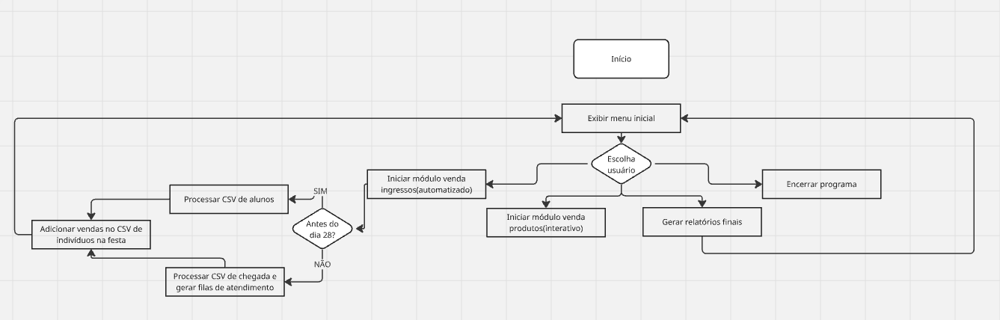

# festinha-junina-ueg
Esse é um sistema que simula a compra de ingressos de uma festa junina.

## Contexto

Uma festa junina será realizada no dia 28 de Maio.
Esse sistema tem por objetivo atender as demandas de venda de ingressos, alimento, controle de estoque, etc.

## Regras de negócio

### Venda de ingressos

#### Venda antes do dia 28

Os ingressos podem ser vendidos antes do dia 28 somente para alunos. Cada aluno pode comprar no máximo 3 ingressos(um para uso próprio e 2 para convidados) Alunos podem fazer uso de um sistema de crédito, que funciona como forma de pagamento dentro da festa. O aluno pode "atribuir um saldo" ao seu crédito
exclusivamente no momento da compra do ingresso e usar esse saldo para pagar por produtos durante a festa. O aluno não é obrigado a gastar todos os seus créditos, e ele pode até mesmo gastar mais do que seus créditos permitem, ficando em débito e sendo obrigado a pagar esse débito ao sair da festa.

Ao sair da festa, o aluno deve pagar o seu débito(caso necessário), ou receber de volta o valor que não foi gasto(caso ele não tenha gastado todos os seus créditos)

#### Venda no dia 28

No dia da festa será necessário implementar uma fila de espera para a venda de ingressos.

A fila tem um sistema de prioridade que separa os indivíduos em três grupos: idosos, estudante e resto.

Idosos tem prioridade máxima, estudante tem prioridade sobre resto.

No dia da festa os alunos ainda podem usar o sistema de créditos e ainda podem comprar ingressos extras para convidados.

##### Observação: 

É importante verificar se a pessoa já não possui um ingresso. Se um aluno já comprou um ingresso pro indivíduo X, o indivíduo X não pode comprar um novo ingresso.

### Venda de produtos nos interiores da festa(alimento, bebidas, etc)

Alunos podem pagar os produtos por meio do crédito. Ao ser feito o pagamento por crédito, deve simplesmente ser decrementado o valor do produto no saldo do aluno. Se isso resultar em um valor negativo, significa que o aluno está em débito e deve realizar o pagamento ao sair da festa(Estar em débito não impede o aluno de comprar novos produtos, contanto que seja feito o pagamento no final)

Os alimentos e bebidas disponibilizados na festa podem ser selecionados posteriormente, mas existe um limite de 4 tipos de bebidas.
Bebidas alcoólicas só podem ser vendidas para maiores de 18 anos.

### Implementações adicionais(Não são prioridades)

#### Controle de estoque

Pensar uma quantidade máxima de alimentos de cada tipo. Para cada venda de um determinado produto, deve ser decrementado a quantidade vendida do estoque geral.
Cada venda deve ser registrada em um arquivo CSV, com produto vendido, quantidade, comprador e valor.
Ao final deve ser possível visualizar de forma geral os lucros da festa a partir desses dados.

### Módulos essenciais para implementação

#### Venda de ingressos

Módulo responsável pela venda de ingressos. Controle do sistema de filas, armazenamento dos compradores.

##### Ideia de implementação inicial

Para venda antes do dia 28 será realizada a leitura de um arquivo CSV que contém informações essenciais sobre o aluno: ID geral, nome, idade, etc.
O arquivo simula a ordem de chegada dos alunos para compra.
Para cada ingresso vendido, deve ser armazenado em um outro arquivo CSV os dados do indivíduo, esse arquivo é a lista de pessoas que compraram ingressos e estão permitidas na festa.

Para venda no dia 28 será implementado três filas dinâmicas simulando a fila de atendimento comum e a fila de atendimento preferencial.
O atendimento preferencial se baseia na idade do indivíduo e se é ou não aluno.
O atendimento será feito de forma alternada, uma quantidade X de atendimentos nas filas prioritária e uma quantidade Y de atendimentos na fila normal por vez.

#### Venda de produtos

Módulo responsável pela venda de produtos dentro da festa.

##### Ideia de implementação inicial

Para cada venda deve ser armazenado em algum arquivo CSV o produto vendido, comprador, valor, etc.
Esse arquivo será necessário para gerar o relatório final de lucros no fim da festa.

Importante também reduzir a quantidade de produtos no estoque.

### Fluxograma inicial projeto

